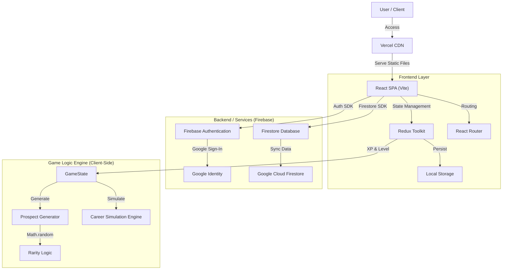
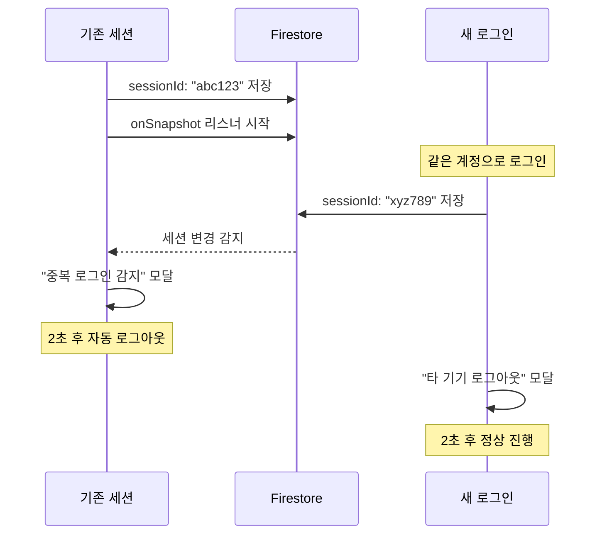

# N1 Baseball Scouter (N1 야구 스카우터)

**JLPT N1 단어/문법 학습과 야구 구단 육성 시뮬레이션을 결합한 게이미피케이션 프로젝트**입니다.
학습을 통해 XP를 획득하고, 유망주를 스카우트하여 최고의 선수로 키워내는 것이 목표입니다.

## 🏗️ Architecture Design

전체 시스템은 **Serverless Architecture**를 기반으로 설계되었습니다. 별도의 백엔드 서버 관리 없이 Firebase와 Vercel을 활용하여 확장성과 유지보수 편의성을 극대화했습니다.


*(Note: 위 이미지는 AI가 생성한 아키텍처 컨셉 이미지입니다)*



---

## 📊 Quantification & Logic (수치화 및 로직 상세)

이 게임의 핵심은 **"학습 보상(XP)이 야구 시뮬레이션 데이터로 변환되는 과정"**의 정교함에 있습니다. 모든 수치는 확률 분포와 가중치 기반의 알고리즘으로 계산됩니다.

### 1. 유망주 생성 알고리즘 (Prospect Generation)
유망주는 **6가지 기초 신체 능력**을 가지고 태어나며, 이는 **희귀도(Rarity)**에 따라 결정됩니다.

*   **희귀도 확률 분포**:
    *   **Genius (천재)**: 5% (잠재력 420~480)
    *   **Ace (에이스)**: 15% (잠재력 360~419)
    *   **Solid (주전급)**: 40% (잠재력 300~359)
    *   **Hard Worker / Late Bloomer**: 40% (특수 성장 곡선)
*   **기초 스탯 (Basic Stats)**:
    *   `Power`, `Flexibility`, `Speed`, `Throwing`, `Bat Speed`, `Grip`
    *   각 스탯은 20(F) ~ 80(S) 사이의 값을 가집니다.

### 2. 야구 스킬 변환 로직 (Skill Conversion)
기초 신체 능력은 포지션(투수/타자)에 따라 **실제 야구 스킬**로 변환됩니다. 단순 1:1 매핑이 아닌 **가중 평균(Weighted Average)** 방식을 사용합니다.

*   **투수 (Pitcher)**:
    *   **구위 (Stuff)**: `(Throwing + Power) / 2` + 난수 보정
    *   **제구 (Control)**: `(Grip + Flexibility) / 2` + 난수 보정
    *   **변화 (Breaking)**: `(Grip + Bat Speed) / 2` + 난수 보정
    *   **구속 (MPH)**: 구위 스탯을 기반으로 `88mph ~ 107mph` 사이로 매핑
*   **타자 (Fielder)**:
    *   **컨택 (Contact)**: `(Bat Speed + Flexibility + Grip*0.5) / 2.5`
    *   **파워 (Power)**: `(Power + Bat Speed + Grip*0.5) / 2.5`
    *   **수비 (Defense)**: `(Speed + Throwing) / 2`

### 3. 커리어 시뮬레이션 엔진 (Simulation Engine)
선수가 프로에 진출하면 **10년~20년의 커리어**를 시뮬레이션합니다.

*   **에이징 커브 (Aging Curve)**:
    *   **성장기 (20~27세)**: 잠재력(Potential)을 향해 능력치가 급격히 상승
    *   **전성기 (27~31세)**: 능력치 유지 (Peak)
    *   **쇠퇴기 (31세~)**: 매년 능력치 하락 (Decline)
*   **성적 산출 (Performance)**:
    *   해당 연도의 능력치(Rating)를 기반으로 **정규 분포** 난수를 적용하여 시즌 성적(타율, 홈런, ERA 등)을 생성합니다.
    *   예: `Rating 80` (S급) -> 타율 `.350` 내외 생성 (표준편차 적용)
*   **수상 기준 (Awards)**:
    *   MVP: 홈런 45개 이상 or 타율 .340 이상 / 18승 이상 & ERA 2.50 미만
    *   수상 실적에 따라 최종 **XP 보상**이 기하급수적으로 증가합니다.

---

## 🚀 Key Features

### 1. Study Mode (학습)
*   **JLPT N1** 필수 단어 및 문법 퀴즈 제공
*   오답 노트(Review Box) 기능: 틀린 문제는 영구 저장되어 복습 유도
*   연속 정답 시 콤보 보너스 획득

### 2. Scouting & Management (육성)
*   **Gacha System**: 학습으로 모은 XP로 유망주 스카우트 (SSR 등급 연출)
*   **Training**: XP를 소모하여 선수의 기초 스탯 강화
*   **Facility**: 레벨이 오를수록 훈련 효율과 스카우트 품질이 상승하는 시설 업그레이드 시스템

### 3. Simulation & Hall of Fame (시뮬레이션)
*   **Auto-Simulation**: 육성이 끝난 선수를 프로로 보내면 즉시 전체 커리어 결과 확인
*   **Hall of Fame**: 은퇴한 레전드 선수들의 기록 영구 보존

---

## 🛠️ Tech Stack

*   **Frontend**: React 19, Vite
*   **State Management**: Redux Toolkit (Persist)
*   **Database & Auth**: Firebase (Firestore, Authentication)
*   **Styling**: Vanilla CSS (Pixel Art / Retro Style)
*   **Deployment**: Vercel

## 📦 Installation

1. **Clone Repository**
   ```bash
   git clone [repository-url]
   cd django-react-app/frontend
   ```

2. **Install Dependencies**
   ```bash
   npm install
   ```

3. **Environment Setup**
   `.env` 파일을 생성하고 Firebase 키를 입력합니다.
   ```env
   VITE_FIREBASE_API_KEY=...
   VITE_FIREBASE_AUTH_DOMAIN=...
   ...
   ```

4. **Run Development Server**
   ```bash
   npm run dev
   ```

---

## 🔐 Data Synchronization & Session Management

### 문제점 (Problem)

1. **데이터 로드 순서 충돌**
   - Redux Persist와 Firebase가 동시에 비동기로 실행
   - 로컬 캐시 데이터가 Firestore 최신 데이터를 덮어쓸 위험
   - 배포 서버와 로컬 개발 환경에서 같은 계정 사용 시 데이터 손실 가능

2. **중복 로그인 이슈**
   - 여러 탭/기기에서 동시 접속 시 데이터 충돌
   - XP 소모 작업(스카우트, 훈련)의 비동기 처리로 중복 작업 발생
   - 마지막 저장이 이전 저장을 덮어쓰는 "Last Write Wins" 문제

### 해결 방안 (Solution)

#### 1. Firestore 우선 로드 보장
```javascript
// 로그인 시 데이터 로드 순서
페이지 로드 
  → Firebase Auth 확인
  → Firestore 데이터 로드 완료 대기
  → Redux 상태 업데이트
  → 앱 렌더링
```

- `dataLoaded` state로 Firestore 로드 완료 추적
- 로그인 사용자는 항상 Firestore 데이터 우선
- 게스트 모드(비로그인)만 Redux Persist 로컬 데이터 사용

#### 2. 실시간 세션 관리

Firestore의 `onSnapshot` 리스너를 활용한 실시간 중복 로그인 감지:



**핵심 로직:**
- 로그인 시 고유 세션 ID 생성 (`crypto.randomUUID()`)
- Firestore에 세션 정보 저장
- 실시간 리스너로 세션 변경 감지
- 중복 감지 시 양쪽 모두 모달 표시 후 기존 세션 강제 로그아웃

### Firestore Security Rules (필수)

Firebase Console → Firestore Database → Rules:

```javascript
rules_version = '2';

service cloud.firestore {
  match /databases/{database}/documents {
    match /users/{userId} {
      allow read, write: if request.auth != null && request.auth.uid == userId;
    }
  }
}
```

---